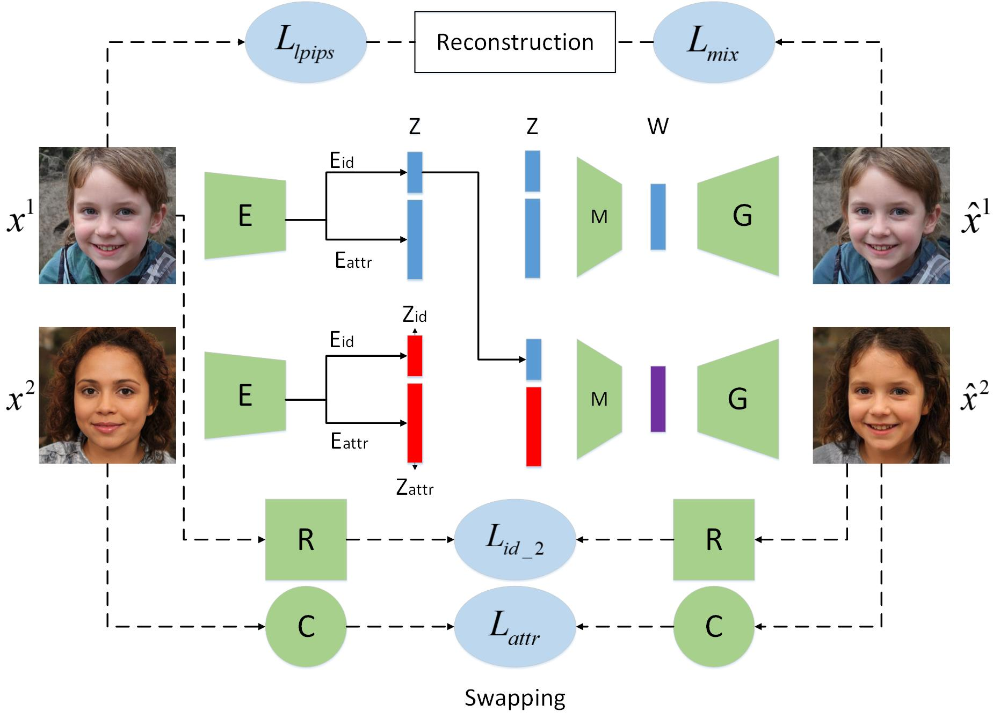
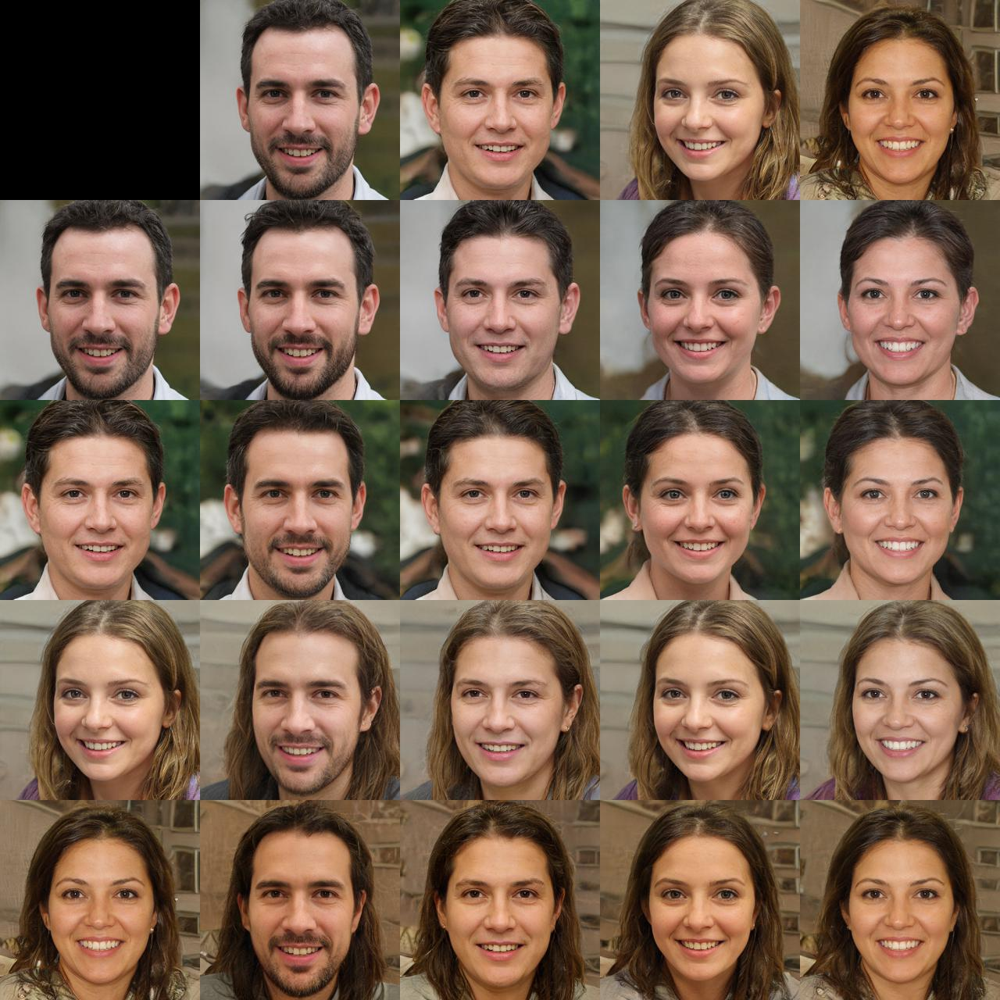
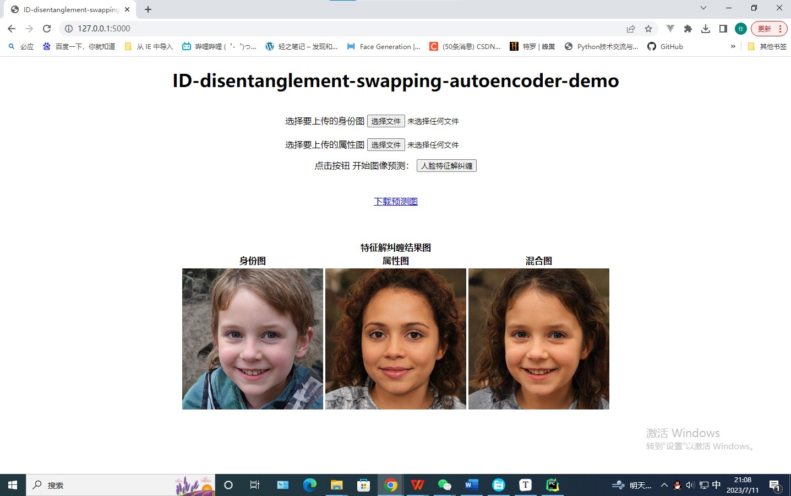

# Controllable face image editing in a disentanglement way - Implement in Pytorch with StyleGAN2

## Description

Pytorch implementation of the paper *[Controllable face image editing in a disentanglement way](https://doi.org/10.1117/1.JEI.32.4.043011)* for both training and evaluation, with StyleGAN2.	 *[This paper](https://caps.luminad.com:8443/stockage/stock/SPIE/LDL-SPIE-JEI-230248G/JEI-230248G_online.pdf)* has been accepted for publication at **Journal of Electronic Imaging**, 2023.

> Authors:  Shiyan Zhou, Ke Wang, Jun Zhang, Yi Xia, Peng Chen, and Bing Wang
>
> 
>
> **Abstract**： The prevalence of deep learning has attracted interest in the face image manipulation domain, especially in face editing with disentanglement representation. However, how to realize controllable disentangled representation of face images still remains challenging. Current methods require extensive supervision and training, or images will have a significantly impaired quality. We present an approach that learns how to represent data in an ideal disentangled way, with minimal supervision. Specifically, we use a swapping autoencoder with identity and attribute branches to learn identity and attribute representations, respectively. In addition, we separate the process of disentanglement and synthesis by an advanced pre-trained unsupervised StyleGAN2 image generator to make the entire network structure focus on learning data disentanglement. The identity and attribute vectors from different images are combined into a new representation that is mapped by a linear mapper into the generator’s latent space to generate a new hybrid image. In this way, we take advantage of StyleGAN2’s most advanced quality and its expressive latent space without the pressure of training a decoder. Experimental results prove that our method successfully separates the identity and other attributes of face images, outperforms existing methods, and requires less training and supervision.

## Reference 

- Reference Code: https://github.com/danielroich/ID-disentanglement-Pytorch
- Reference papers: https://arxiv.org/abs/2005.07728

Our code is more complicated, if you want to run it on your own computer, you need to re-modify the dataset path. If you have other things that you don't understand, you can also refer to the above **Reference Code**.

## Setup

We used several **pretrained models**: 
- StyleGan2 Generator for image size 256 - 550000.pt
- ID Encoder - model_ir_se50.pth
- Landmarks Detection - mobilefacenet_model_best.pth.tar

Weight files attached at this [Drive folder](https://drive.google.com/drive/folders/18K5YBBJRiCIradtttlLcdtSyLUo3cUI5?usp=sharing).

You can also find at the above link our **environment.yml** file to create a relevant conda environment.

## Datasets  

The dataset is comprised of StyleGAN 2 generated images. 

We randomly sample 70,000 Gaussian noises $z$ and then map them to $\mathcal{W}$, the latent space of the pre-trained generator G, which in turn generates the resulting images $G(w)$ . Actually, to improve the average quality of the generated images, we first calculate the average vector $\bar{w} $ from the latent space $\mathcal{W}$ of the selected pretrained StyleGAN2 generator. Finally, the resulting images $G(w+\bar{w} )$  are used as our training dataset. The test dataset is generated in the same way.

You can use Utils/**data_creator.py**  to generate the dataset in the paper.

## Training

Note, I recommend that you use Utils/**data_creator.py** to generate training dataset, which saves you the trouble of paths.

To train the model run **train.py**, you can change parameters in **Configs/** folder.

## Checkpoints

Our pretrained checkpoints (swap_encoder.pt and mlp.pt) attached at this https://pan.baidu.com/s/1uI49sT58jadTV8ZPbPAVIQ 
Extraction code：9hq6 . Or you can get your own checkpoints by  **train.py**.

## Inference

Try **Inference.py** notebook to disentangle identity from attributes by yourself.

## Results

## Web_Demo

We additionally provide a Web_Demo, which is an independent project and is placed under the `Web_Demo` folder. If you want to experience this demo, you can download our pre-trained checkpoints and put them under `Web_Demo\checkpoints` folder. 

Under the `Web_Demo\static\images` folder, we also provide 2 example images.

1. 采用HTML、CSS、JavaScript部署浏览器页面。
2. 采用Pytorch 深度学习框架，构建server的图像处理模型。
3. 采用Flask，这个轻量级web框架 ，来实现前后端通信。

<video id="video" controls="" src="https://github.com/YuGong123/Controllable-face-image-editing-in-a-disentanglement-way/blob/main/web-demo.mp4" ></video>
